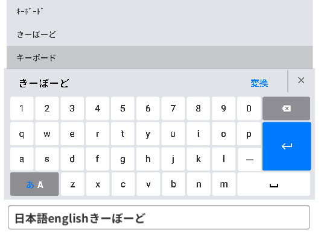
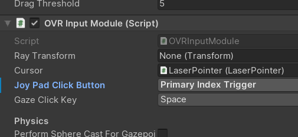
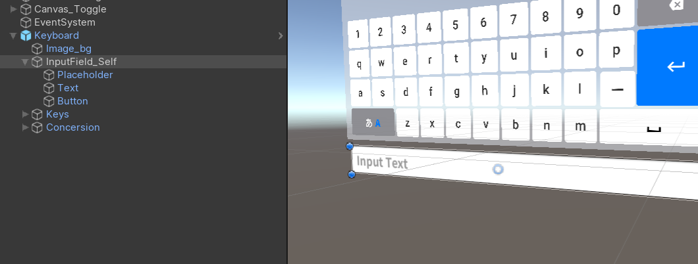
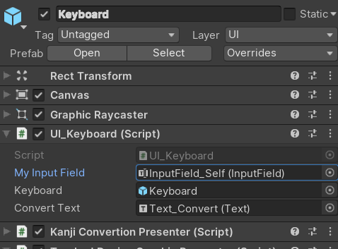
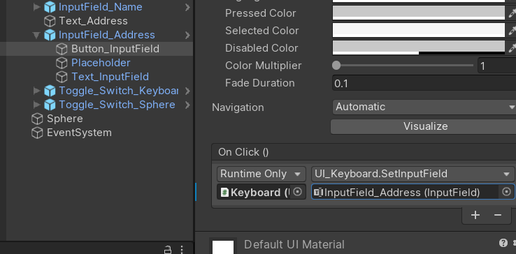

# About

VR、デスクトップで使えるQWERTY配列キーボードです。

PCのキーボードと同じように日本語と英語の切り替えができます。

VRのみならず、デスクトップモードで2D状態でマウス入力などもできます。

# Tested Environment
* Windows10
* Unity2019.3.0f3,Unity2019.2.19f1
* Oculus Quest(with OculusLink)
* [XR Interaction Toolkit](https://docs.unity3d.com/Packages/com.unity.xr.interaction.toolkit@0.9/manual/index.html)

Unity2018.Xでは動作しません。
# Add Third party assets

以下のアセットを入れてください

UniRx

https://assetstore.unity.com/packages/tools/integration/unirx-reactive-extensions-for-unity-17276

UniTask

https://github.com/Cysharp/UniTask

# Third party Font

このプロジェクトには以下のフォントが含まれています。

NotoSansCJKjp-hinted

https://www.google.com/get/noto/help/cjk/

Robot

https://fonts.google.com/specimen/Roboto

# 使い方

## Prefabを置く

VRUIParts>JapaneseEnglishKeyboard>Prefabsの中のJapaneseEnglishKeyboardをシーンに置く。

Prefab自身がCanvasになっている。CanvasのモードはWorldSpace

## VRでのUI入力の設定
VR用のToolkitを入れる

* [XR Interaction Toolkit](https://docs.unity3d.com/Packages/com.unity.xr.interaction.toolkit@0.9/manual/index.html)
* [Oculus Integration](https://assetstore.unity.com/packages/tools/integration/oculus-integration-82022)
* [VRTK](https://assetstore.unity.com/packages/tools/integration/vrtk-virtual-reality-toolkit-vr-toolkit-64131)
  
　etc

対応するスクリプトをCanvasに付けると、各ToolkitのレーザーポインターなどでuGUIパーツが入力できるようになる。

XR Interaction Toolkit　→　TrackedDeviceGraphicRaycaster

OculusIntegration　→　OVR Raycaster

VRTK　→　VRTK_UICanvas

## 各ライブラリのメモ

OculusIntegrationでレーザー入力するにはUIHelperというプレハブを使うといい。Aボタンがクリックになっている。

UIHelper>EventSystemについているOVRInputModuleのJoyPadClickButtonをPrimary Index Triggerにするとトリガーで入力できる。

入力ができない場合はシーンにEventSystemが１つあるかを確認する。

# 任意のInputFieldを出力先にする方法
デフォルトではKeyboardの下にあるInputField_Selfに入力したテキストが表示される。InputField_Selfは不必要だったら消していい。

以下に、用意したInputFieldを出力先にする方法を示す。

## KeyboardのInspectorで直接設定

JapaneseEnglishKeyboardのUI_KeyboardのInputFieldに対象のInputFieldをセットすればよい。

## UnityEvent経由

InputFieldをクリックしたらそのInputFieldに入力されるという風にするにするとする。

この場合InputFieldの下などにButtonを作り、ButtonのOnClick()イベントでUI_Keyboard.cs>SetInputFieldに対象のInputFieldを渡せばよい。

UITestScene_3DVRシーンのInputField_Addressを参照

## スクリプト経由

UI_Keyboard.csのSetInputField()に入れる。

UITestScene_3DVRシーンのInputField_NameのOutside Input Field Test.cs参照

# Enterの機能

現在Enterキーの機能は入力中の日本語を変換フィードから消すという機能しかない。

Enterに機能を持たせる場合はUI_KeyboardのEnter()に書き込む。

# 不具合等
* InputFieldが切り替わらない。

* カーソルを動かして、文字列の途中に入力することはできない。

* 英語の大文字は入力できない

* クリックを離したときに入力されるため、入力しずらい

# サードパーティーの権利表記

## UniRx

The MIT License (MIT)

Copyright (c) 2018 Yoshifumi Kawai
https://github.com/neuecc/UniRx/blob/master/LICENSE

## UniTask

The MIT License (MIT)

Copyright (c) 2019 Yoshifumi Kawai / Cysharp, Inc.
https://github.com/Cysharp/UniTask/blob/master/LICENSE

## [NotoSansCJKjp-hinted (Font)](https://www.google.com/get/noto/help/cjk/)

SIL Open Font License, Version 1.1.

http://scripts.sil.org/OFL

## [Robot (Font) ](https://fonts.google.com/specimen/Roboto)
Apache License, Version 2.0

http://www.apache.org/licenses/LICENSE-2.0

## [Icons](https://material.io/resources/icons/?style=baseline)
Apache License, Version 2.0

http://www.apache.org/licenses/LICENSE-2.0

# 参考

キーボードの構造は[「VRTK」]((https://assetstore.unity.com/packages/tools/integration/vrtk-virtual-reality-toolkit-vr-toolkit-64131))のWorldKeyboardをもとに作りました。

ローマ字かな変換は[「ローマ字→平仮名変換関数 #javascript」](https://c4se.hatenablog.com/entry/20100330/1269906760)を参考に作りました。

# Licence

このプロジェクトは、サードパーティのアセットを除き、[MIT License](LICENSE.md)でライセンスされています。

This project is licensed under the MIT License excluding third party assets.