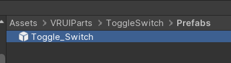
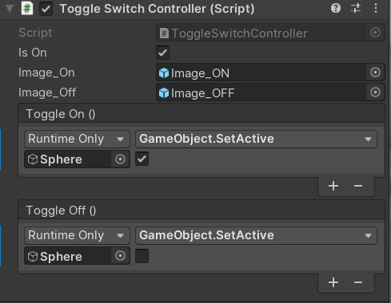
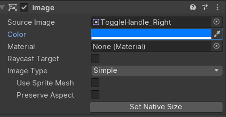

# About

VR、デスクトップで使えるToggleSwitchです

# 使い方

自分でCanvasを作り、TogglePrefabをCanvasの子に置く

## ToggleSwitchController

* inOn

初期状態。チェックが入っているとONの状態で始まる。入っていなければOFF

* ToggleOn、ToggleOffイベント

uGUIのButton処理と同じように、それぞれの状態でしたい処理を設定する。

## デザイン変更

Image_On,OFFそれぞれImageのColor変更で色を変えられる。

Image_HandleColorで丸い部分の色を変えられる。背景に四角を置いてるだけなのでいらなかったら消す。

ON,OFFスイッチ時のアニメーションとかはない。ImageのActiveを切り替えている。

# サードパーティーの権利表記

## [Icons](https://material.io/resources/icons/?style=baseline)
Apache License, Version 2.0

http://www.apache.org/licenses/LICENSE-2.0

# Licence

このプロジェクトは、サードパーティのアセットを除き、[MIT License](LICENSE.md)でライセンスされています。

This project is licensed under the MIT License excluding third party assets.
